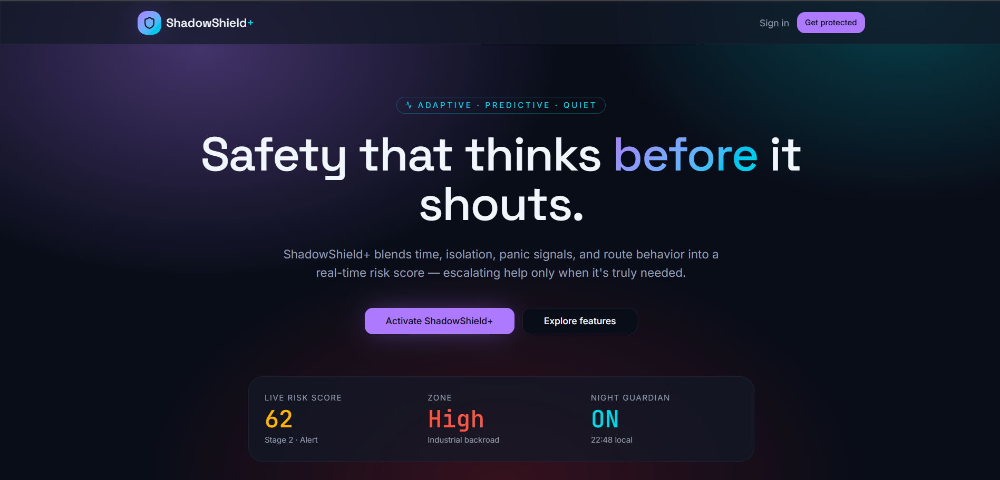
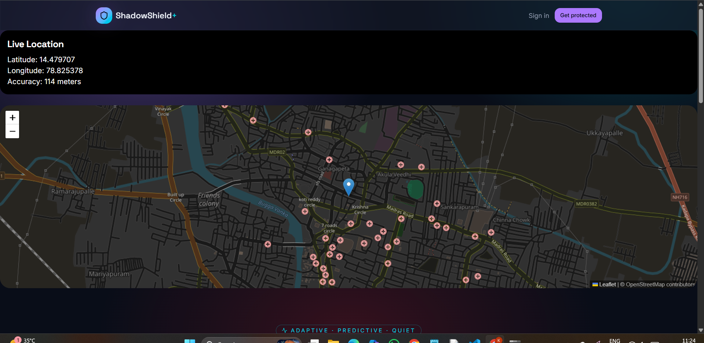

ShadowShield+ is an AI-powered women safety platform that predicts risky situations in isolated/night areas using smart risk analysis, shadow detection, and route monitoring. It reduces false alarms and automatically escalates emergencies through alerts, calls, trusted contacts, and police support.

## Screenshots

### Landing Page

### Dashboard

### Live Tracking
